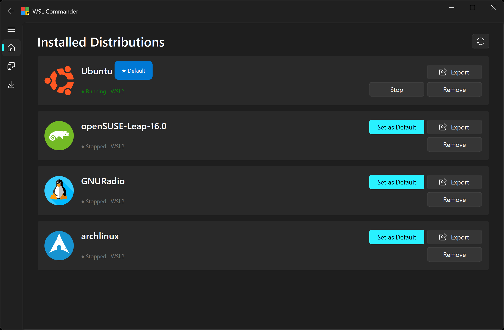
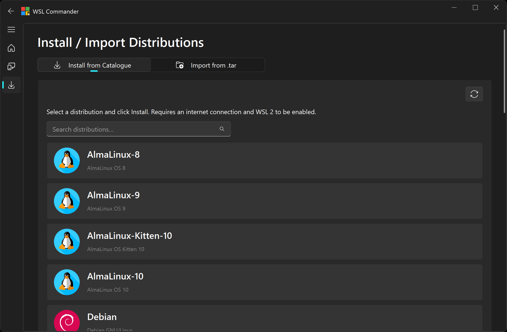
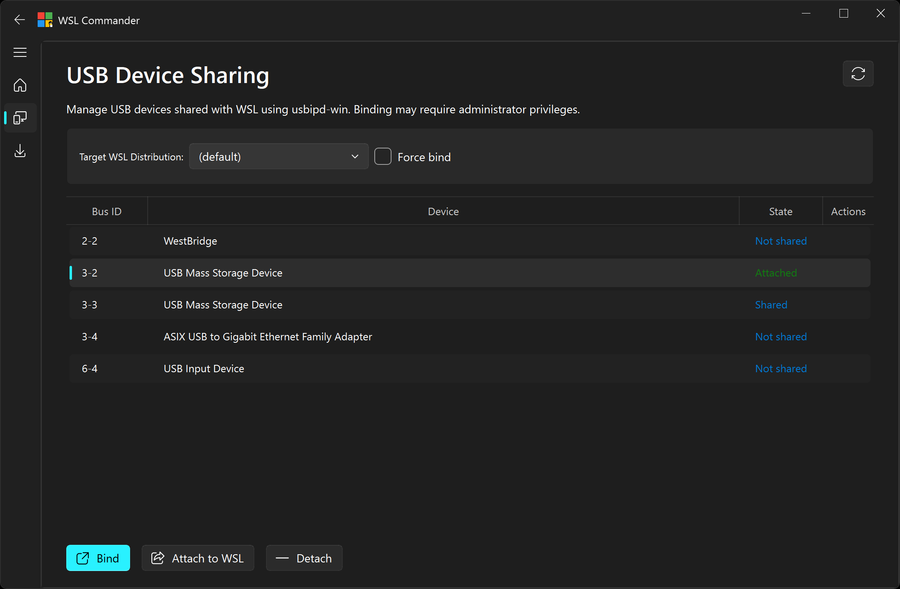

# WSL Commander

A modern Windows desktop application for managing your **Windows Subsystem for Linux (WSL2)** distributions — built with Python and PyQt6 Fluent Widgets.


---

## Features

- 📋 **View** all installed WSL distributions with live status and version info
- ▶️ **Launch** a terminal for any distribution with a single click
- ⭐ **Set** a distribution as the system default
- ⏹️ **Stop** a running distribution
- 🗑️ **Remove** a distribution
- 💾 **Export** a distribution to a `.tar` archive for backup or transfer
- 📦 **Install** new distributions from the official online catalogue
- 📂 **Import** a distribution from a `.tar` archive with a custom name and install location
- 🔌 **USB Sharing** — list connected USB devices and manage their attachment to WSL
- 🎨 Modern Fluent Design UI with automatic light/dark theme support

---

## Screenshots

### Installed Distributions


### Install / Import a Distribution


### USB Device Management


---

## Requirements

- Windows 10 or Windows 11 with WSL2 enabled
- Python 3.10 or higher

### Enable WSL2 (if not already set up)

Open an elevated PowerShell and run:

```powershell
wsl --install
```

Restart your machine before launching WSL Commander.

---

## Installation

### 1. Clone the repository

```bash
git clone https://github.com/yourusername/WSLCommander.git
cd WSLCommander
```

### 2. Create a virtual environment (recommended)

```powershell
python -m venv .venv
.venv\Scripts\activate
```

### 3. Install dependencies

```powershell
pip install -r requirements.txt
```

### 4. Run

```powershell
python main.py
```

---

## Project Structure

```
WSLCommander/
├── app/
│   ├── main_window.py        # Main application window
│   ├── models/               # Data models (Distro, UsbDevice)
│   ├── pages/                # UI pages (Distributions, Install, USB)
│   ├── utils/                # Helpers (logo resolver)
│   └── workers/              # Background QThread workers (WSL, USB)
├── assets/
│   ├── distros/              # Distribution logo images
│   └── icon/                 # Application icon
├── docs/
│   └── screenshots/          # Application screenshots
├── main.py                   # Entry point
├── requirements.txt
└── README.md
```

---

## Dependencies

| Package | Purpose |
|---|---|
| `PyQt6>=6.6.0` | Qt6 Python bindings |
| `PyQt6-Fluent-Widgets[full]>=1.6.0` | Fluent Design UI component library |

---

## License

This project is licensed under the MIT License. See the [LICENSE](LICENSE) file for details.

